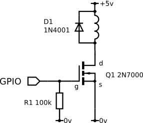

# Working with GPIO

GPIO (General-Purpose Input/Output) – is a type of Raspberry Pi's pins, with programmatically adjustable and measurable voltage. On some of the pins there also is hardware implemented <abbr title="Pulse-width modulation">PWM</abbr>.

> **Info** Use the [pinout](https://pinout.xyz) for figuring out, which Raspberry Pi's pins support GPIO and PWM.

[The RPi image](microsd_images.md) includes [`pigpio`](http://abyz.me.uk/rpi/pigpio/) library for work with GPIO. To interact with this library, run the appropriate daemon:

```bash
sudo systemctl start pigpiod.service
```

For enabling automatic launch of the daemon, use command:

```bash
sudo systemctl enable pigpiod.service
```

Example of working with the library:

```python
import time
import pigpio

# initializing connection to pigpiod
pi = pigpio.pi()

# setting pin 11 mode for output
pi.set_mode(11, pigpio.OUTPUT)

# enabling signal of pin 11
pi.write(11, 1)

time.sleep(2)

# disabling signal on pin 11
pi.write(11, 0)

# ...

# setting pin 12 mode for input
pi.set_mode(12, pigpio.INPUT)

# read the state of pin 12
level = pi.read(12)
```

For finding out pins' numbers, use the [Raspberry Pi pinout](https://pinout.xyz).

## Connecting servos

Most of servos are controlled with PWM signal. Extreme positions of servos are reached with signal widths approximately equal to 1000 and 2000 µs. Values for a specific servo can be determined experimentally.

Connect the signal wire of the servo to one of GPIO-pins of the Raspberry. For controlling a servo, connected to the pin 13, use a code like this:

```python
import time
import pigpio

pi = pigpio.pi()

# setting mode of pin 13 to output
pi.set_mode(13, pigpio.OUTPUT)

# setting pin 13 to output PWM signal 1000 us
pi.set_servo_pulsewidth(13, 1000)

time.sleep(2)

# setting pin 13 to output PWM signal 2000 us
pi.set_servo_pulsewidth(13, 2000)
```

## Connecting electromagnet



For connecting an electromagnet, use a field-effect transistor (MOSFET). Connect the MOSFET to one of GPIO-pins of the Raspberry Pi. For controlling the magnet, connected to the pin 15, use a code like this:

```python
import time
import pigpio

pi = pigpio.pi()

# setting mode of pin 15 for output
pi.set_mode(15, pigpio.OUTPUT)

# enabling the magnet
pi.write(15, 1)

time.sleep(2)

# disabling the magnet
pi.write(15, 0)
```
